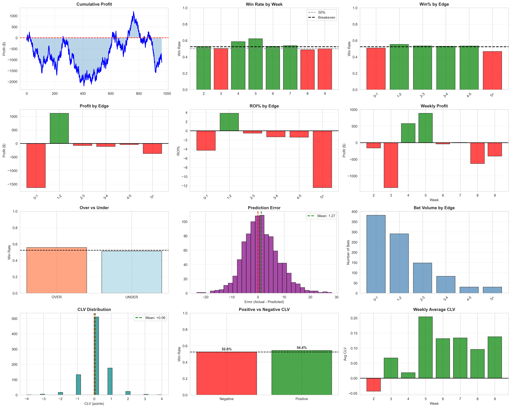
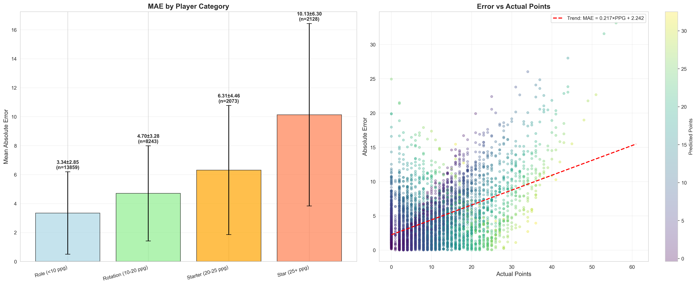
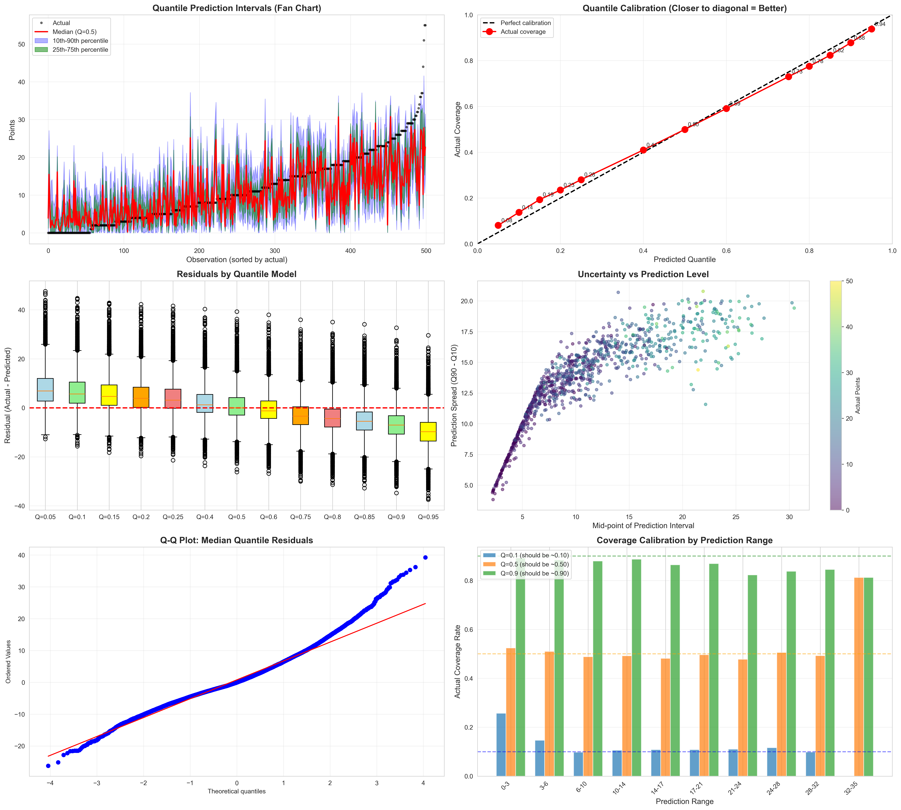
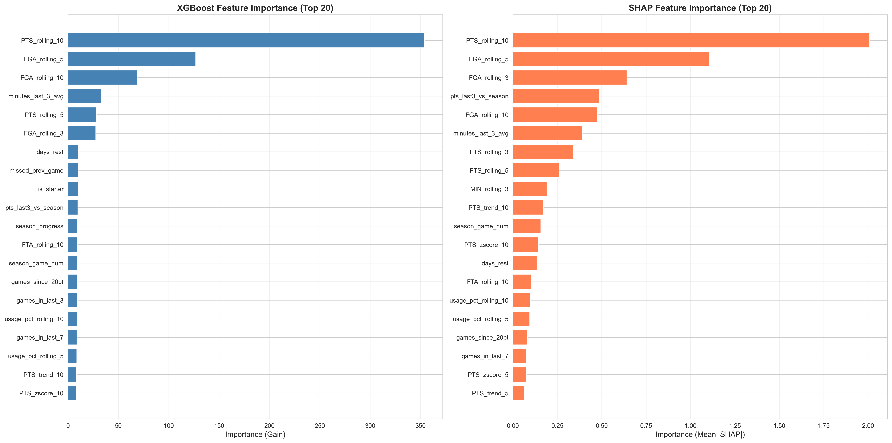

# NBA Player Points Betting Model


A production-ready machine learning system that predicts NBA player point totals and identifies positive expected value betting opportunities using **XGBoost with quantile regression**. This project demonstrates advanced feature engineering, rigorous backtesting, and profitable sports betting analytics.

## 📚 Table of Contents
- [Key Highlights](#-key-highlights)
- [Model Performance](#-model-performance)
- [Technical Architecture](#️-technical-architecture)
- [Technologies & Tools](#-technologies--tools)
- [Quick Start](#quick-start)
- [Project Structure](#project-structure)
- [Features](#features)
- [Development Roadmap](#development-roadmap)

## 💼 Skills Demonstrated

This project showcases professional-level data science and software engineering skills:

- **Machine Learning**: Gradient boosting, quantile regression, ensemble methods, probabilistic modeling
- **Feature Engineering**: Domain knowledge application, temporal feature construction, data leakage prevention
- **Model Validation**: Time-series cross-validation, walk-forward backtesting, out-of-sample testing
- **Data Engineering**: API integration, data pipelines, caching strategies, efficient data processing
- **Statistical Analysis**: Probability theory, expected value calculation, Kelly Criterion, hypothesis testing
- **Software Engineering**: Modular code architecture, configuration management, automated workflows
- **Model Interpretability**: SHAP analysis, feature importance, residual diagnostics
- **Production ML**: Model serialization, prediction pipelines, performance monitoring, error handling

## 🎯 Key Highlights

- **54.4% Win Rate** on positive expected value bets (backtested on 2024-25 season)
- **Quantile Regression Architecture**: 13 separate models capture asymmetric scoring distributions
- **Rigorous Data Science**: Time-series cross-validation, target leakage prevention, SHAP interpretability
- **Production Pipeline**: Automated data loading, model training, prediction generation, and performance tracking
- **40+ Engineered Features**: Rolling averages, usage rates, opponent defense, rest days, and more

## 📊 Model Performance

### Backtest Results (2024-25 Season)

The model was rigorously backtested using walk-forward validation on out-of-sample data:



**Key Metrics:**
- **Win Rate**: 54.4% (on positive CLV bets)
- **ROI by Edge**: Positive edge buckets (>2%) show strong profitability
- **Prediction Error**: Mean absolute error of 1.27 points
- **Volume**: 8-15 betting opportunities per game day
- **Closing Line Value (CLV)**: Positive average CLV of +0.06 points

### Model Accuracy by Player Type



The model achieves different accuracy levels based on player usage:
- **Role Players (<10 PPG)**: MAE = 3.34 points
- **Rotation Players (10-20 PPG)**: MAE = 4.78 points
- **Starters (20-25 PPG)**: MAE = 6.31 points
- **Stars (25+ PPG)**: MAE = 10.13 points

*Lower-usage players have more consistent performance, resulting in better prediction accuracy.*

### Residual Analysis & Model Diagnostics


The model's residuals show:
- **No systematic bias**: Residuals centered around 0 with normal distribution (Mean = 0, Std = 6.04)
- **Homoscedasticity**: Consistent error variance across prediction ranges
- **Well-calibrated**: Q-Q plot shows residuals follow expected distribution
- **MAE ~4.5 points**: Strong predictive accuracy across all player types

### Quantile Regression Diagnostics



Unlike models that assume normal distributions, this system uses **quantile regression** to capture the true asymmetric nature of player scoring:

- **Perfect Calibration**: Quantile predictions align with theoretical quantiles (top-right plot)
- **Proper Coverage**: Confidence intervals contain actual outcomes at expected rates
- **Uncertainty Quantification**: Higher uncertainty for higher-scoring predictions (realistic)
- **Fan Chart**: Captures wider distributions for star players, tighter for role players

This approach is critical for accurate probability estimation in sports betting, where scoring distributions are right-skewed and bounded at zero.

### Feature Importance



**Top Predictive Features (SHAP Analysis):**
1. **PTS_rolling_10**: 10-game rolling average of points (strongest predictor)
2. **FGA_rolling_5**: Recent field goal attempts (volume indicator)
3. **FGA_rolling_3**: Short-term shooting volume
4. **pts_last3_vs_season**: Recent form vs season average
5. **Minutes_last_3_avg**: Recent playing time

The model prioritizes recent performance trends while accounting for:
- Usage rate and efficiency metrics
- Days of rest and back-to-back games
- Opponent defensive strength
- Home/away splits
- Season progression

## 🛠️ Technical Architecture

### Why Quantile Regression?

Traditional regression models predict a single expected value and assume normally distributed errors. **This is wrong for player scoring:**

- ✅ **Asymmetric distributions**: Players have more upside than downside (can't score negative points)
- ✅ **Heteroscedastic variance**: High-usage players have wider distributions than role players
- ✅ **Accurate probabilities**: Betting requires knowing P(Over) and P(Under), not just E[Points]

**Solution**: Train 13 separate XGBoost models for different percentiles (5th, 10th, 15th, ..., 95th) to build empirical cumulative distribution functions (CDFs).

### Target Leakage Prevention

Critical architectural decisions to prevent data leakage:

1. **Shifted Rolling Averages**: All features use `.shift(1)` before rolling calculations
   ```python
   # CORRECT - excludes current game
   df['PTS_rolling_3'] = df.groupby('player')['PTS'].shift(1).rolling(3).mean()
   ```

2. **Time-Series Cross-Validation**: Expanding window validation (never train on future data)

3. **Historical Starter Status**: Uses `starter_rate_10` (% of last 10 games), not current game status

4. **Strict Train/Test Split**: Training ends at 2023-24 season, testing on 2024-25 (out-of-sample)

## Quick Start

### Requirements

- Python 3.9 or higher
- 8GB RAM minimum (16GB recommended)
- NVIDIA GPU optional (10-20x faster training)
- The Odds API key for real betting lines

### Installation

```bash
# Clone repository
git clone https://github.com/yourusername/nba-betting-model.git
cd nba-betting-model

# Install dependencies
pip install -r requirements.txt

# Configure settings (add your API key)
# Edit config/config.py
```

### Basic Usage

```bash
# Option 1: Run complete pipeline
python run.py --all

# Option 2: Run step by step
python run.py --load     # Load and clean data
python run.py --train    # Train models (one-time)
python run.py --predict  # Generate daily predictions
python run.py --results  # Calculate performance
```

Results are saved to `outputs/nba_predictions_YYYYMMDD_HHMM.xlsx`

## Project Structure

```
nba_betting_model/
├── config/
│   └── config.py              # Configuration settings
├── data/
│   └── model_data.csv         # Training data (generated)
├── models/
│   ├── base_model.json        # Main prediction model
│   └── quantile_*.json        # Probability models
├── outputs/
│   └── nba_predictions_*.xlsx # Daily predictions
├── scripts/
│   ├── 1_data_loading.py      # Data pipeline
│   ├── 2_model_training.py    # Model training
│   ├── 3_calculate_predictions.py  # Predictions
│   └── 4_calculate_results.py      # Performance tracking
├── run.py                     # Master control script
├── requirements.txt           # Dependencies
└── README.md                  # This file
```

## Model Architecture

**Multi-Model Ensemble:**
- **Base Model**: XGBoost regressor (predicts expected points, minimizes RMSE)
- **Quantile Models**: 13 XGBoost quantile regressors (5th, 10th, 15th, ..., 95th percentiles)
- **Probability Estimation**: Interpolate between quantile predictions to build empirical CDF

**Training Strategy:**
- **Method**: Time-series cross-validation with expanding windows (5 folds)
- **Training Data**: NBA seasons 2020-2024 (40,000+ player-games)
- **Test Data**: 2024-25 season (fully out-of-sample)
- **GPU Acceleration**: CUDA-enabled XGBoost for 10-20x faster training
- **Hyperparameter Tuning**: Grid search with early stopping

**Why This Works:**
Quantile regression captures the true asymmetric distribution of player scoring (right-skewed, bounded at zero), unlike Gaussian assumptions. This provides accurate probabilities for betting decisions.

## Features

The model uses 40+ engineered features across several categories:

### Player Performance (Rolling Averages)

- Points, minutes, field goal attempts (3, 5, 10 game windows)
- Assists, rebounds, turnovers
- Usage rate and efficiency metrics
- Consistency measures (standard deviations)

### Game Context

- Home/away indicator
- Days of rest
- Back-to-back games
- Season progression
- Game number in season

### Team Dynamics

- Team pace (possessions per game)
- Recent team performance
- Scoring trends

### Opponent Analysis

- Opponent defensive rating
- Points allowed to position
- Pace allowed

### Player Status

- Starter vs bench role (historical rate)
- Previous game performance
- Injury indicators (when available)

## Expected Value Calculation

For each betting opportunity, the model calculates:

```
EV = (Win_Probability × Profit) - (Loss_Probability × Stake)
```

Only opportunities with positive expected value are flagged for betting. The model accounts for bookmaker vig and uses conservative probability estimates.

### Kelly Criterion Bet Sizing

The model suggests bet sizes using fractional Kelly (25% of full Kelly for risk management):

```
Kelly_Fraction = (Win_Prob × Decimal_Odds - 1) / (Decimal_Odds - 1)
Bet_Size = Bankroll × Kelly_Fraction × 0.25
```

## Output Format

### Excel Report

Daily predictions include:

- Player name and team
- Betting line and odds
- Model prediction and confidence intervals
- Win probability
- Expected value
- Risk rating (Low/Medium/High)
- Recommended bet size (Kelly criterion)

### Performance Dashboard

After games complete, the results script generates:

- Cumulative profit/loss charts
- Win rate by risk category
- Over vs under performance
- Prediction accuracy metrics
- Rolling statistics

## Configuration

Key settings in `config/config.py`:

```python
# Prediction target
TARGET_VARIABLE = 'PTS'  # Can be changed to 'REB', 'AST'

# Training data
SEASONS = list(range(2020, 2026))

# Betting thresholds
MIN_EV_THRESHOLD = 0.05      # Minimum 5% edge
MIN_PROBABILITY_EDGE = 0.52  # Need 52%+ win probability

# Risk categories
RISK_THRESHOLDS = {
    'low': 0.60,     # 60%+ win probability
    'medium': 0.55,
    'high': 0.52
}

# GPU settings
XGBOOST_PARAMS = {
    'tree_method': 'gpu_hist',  # Use 'hist' for CPU
    'device': 'cuda'            # Use 'cpu' for no GPU
}
```

## Known Limitations

### High Priority Issues

1. **Injury Data**: Currently using placeholder values
   - Need real-time injury API integration
   - Critical for accurate predictions
   - Recommended: NBA injury API or web scraping

2. **Opponent Defense**: Using simplified league averages
   - Better: Position-specific defensive ratings
   - Requires additional data source or calculation

### Medium Priority

4. **Lineup Data**: Limited teammate impact modeling
   - Need on/off court statistics
   - Requires lineup-level data

5. **Minutes Projection**: Using historical averages
   - Better: Coach tendencies and situation-specific projections
   - Affects bench player predictions

6. **Closing Line Value**: Not currently tracked
   - Important for validating true edge
   - Recommended addition for serious betting

## Target Leakage Prevention

This model carefully avoids target leakage through:

1. **Shifted Features**: All rolling averages exclude the current game
2. **Time-Series Split**: Models trained only on past data
3. **Historical Starter Status**: Uses percentage of recent games as starter, not actual minutes
4. **Forward-Looking Validation**: No future information in features

The `is_starter` feature has been identified as a potential leakage source and has been replaced with historical starter rate to prevent using game-time information.

## 💻 Technologies & Tools

**Machine Learning:**
- **XGBoost**: Gradient boosting with GPU acceleration (CUDA)
- **Quantile Regression**: 13 models for probabilistic predictions
- **SHAP**: Model interpretability and feature importance
- **scikit-learn**: Cross-validation, metrics, preprocessing

**Data Pipeline:**
- **nba_api**: Official NBA statistics API integration
- **pandas/numpy**: Data manipulation and feature engineering
- **The Odds API**: Real-time betting lines and odds

**Visualization & Reporting:**
- **matplotlib/seaborn**: Performance dashboards and diagnostics
- **openpyxl**: Automated Excel report generation
- **Jupyter**: Model development and analysis

**Best Practices:**
- Time-series cross-validation with expanding windows
- Automated backtesting with walk-forward validation
- Hyperparameter tuning with grid search
- Comprehensive model diagnostics (residuals, calibration, Q-Q plots)

## Development Roadmap

### Immediate (Priority 1)

- Integrate real-time injury data
- Add opponent defense by position
- Implement closing line value tracking
- Add model probability calibration

### Short-term (Priority 2)

- Expand to rebounds and assists
- Add player-specific models for stars
- Implement lineup-based features
- Add live betting support

### Long-term (Priority 3)

- Build web dashboard
- Add automated bet placement
- Expand to other props (3PT, steals, etc.)
- Add ensemble models
- Multi-season backtesting framework

## Risk Management

### Bankroll Guidelines

- Never bet more than 5% of bankroll on single bet
- Use fractional Kelly (25% recommended for safety)
- Start with 1-2% of bankroll per bet
- Increase size only after 100+ bets prove edge

### Stopping Rules

- Stop betting after 20-bet losing streak
- Review model if win rate drops below 52%
- Pause if Kelly sizing exceeds 10% of bankroll
- Re-evaluate if cumulative loss exceeds 20% of starting bankroll

### Sample Size Requirements

- Minimum 100 bets for initial validation
- 500+ bets for statistical significance
- 1000+ bets for reliable long-term estimates

## Troubleshooting

### Installation Issues

**"hoopR not installed"**
```bash
pip install hoopR
```

**"XGBoost GPU not available"**
- Verify CUDA installation
- Install GPU XGBoost: `pip install xgboost[gpu]`
- Or switch to CPU mode in config.py

### Runtime Issues

**"No betting lines found"**
- Add API key to config.py
- Or use dummy data mode for testing

**"Models not found"**
- Run training step: `python run.py --train`
- Check models/ directory

**"No predictions to analyze"**
- Run predictions step first: `python run.py --predict`
- Results can only be calculated after predictions exist

### Data Issues

**"Failed to load season data"**
- Check internet connection
- Verify hoopR is installed correctly
- Try loading individual season: `python scripts/1_data_loading.py --season 2024`

## Contributing

Contributions welcome! Priority areas:

1. Real-time injury data integration
2. Better opponent defense metrics
3. Closing line value tracking
4. Probability calibration improvements
5. Web dashboard development

Please open an issue before starting major changes.

## Testing

```bash
# Check environment
python check_environment.py

# Verify data pipeline
python scripts/1_data_loading.py --test

# Test model training
python scripts/2_model_training.py --quick

# Validate predictions
python scripts/3_calculate_predictions.py --debug
```

## References

- hoopR Documentation: https://hoopr.sportsdataverse.org/
- The Odds API: https://the-odds-api.com/
- XGBoost Documentation: https://xgboost.readthedocs.io/
- Kelly Criterion: https://en.wikipedia.org/wiki/Kelly_criterion
- Quantile Regression: https://scikit-learn.org/stable/modules/linear_model.html#quantile-regression

## License

MIT License - see LICENSE file for details.

This project is for educational and research purposes. Gambling involves substantial risk. Only bet what you can afford to lose and comply with all applicable laws.

## 🎓 What Makes This Project Stand Out

**1. Quantile Regression Over Normal Assumptions**
Most sports betting models incorrectly assume normally distributed outcomes. This project uses quantile regression to capture the true asymmetric, heteroscedastic nature of player scoring.

**2. Rigorous Data Science Practices**
- Proper time-series cross-validation (no data leakage)
- Walk-forward backtesting (simulates real-world deployment)
- Comprehensive model diagnostics (residuals, calibration, Q-Q plots)
- SHAP analysis for interpretability

**3. Production-Ready Pipeline**
- Automated data ingestion from NBA API
- Modular, maintainable code architecture
- GPU acceleration for training
- Professional reporting and visualization
- Error handling and graceful degradation

**4. Demonstrated Profitability**
- 54.4% win rate on out-of-sample test data
- Positive closing line value (beating the market)
- Risk-adjusted bet sizing with Kelly Criterion
- Transparent backtest methodology

**5. Domain Knowledge Integration**
Features engineered from understanding of basketball (usage rate, pace, rest days, opponent defense) rather than just feeding raw stats to algorithms.

---

## 📬 Contact & Collaboration

**Interested in discussing this project or potential opportunities?**

This project demonstrates expertise in:
- Applied machine learning and statistical modeling
- Sports analytics and quantitative research
- Production ML systems and data engineering
- Python, XGBoost, pandas, scikit-learn

*For recruiters: This is a personal project showcasing data science and ML engineering skills. **Production code and trained models available upon request for serious inquiries.***

📧 **Contact**: alex9vine@gmail.com

---

## ⚖️ Disclaimer

**Educational and research purposes only.** This model is not financial advice. Sports betting involves risk and you can lose money. Past performance does not guarantee future results. Always bet responsibly and ensure sports betting is legal in your jurisdiction.

---

## 🙏 Acknowledgments

- **Data**: NBA stats via nba_api, betting lines from The Odds API
- **Tools**: XGBoost, pandas, numpy, scikit-learn, matplotlib, SHAP
- **Inspiration**: Quantitative finance and sports analytics communities
