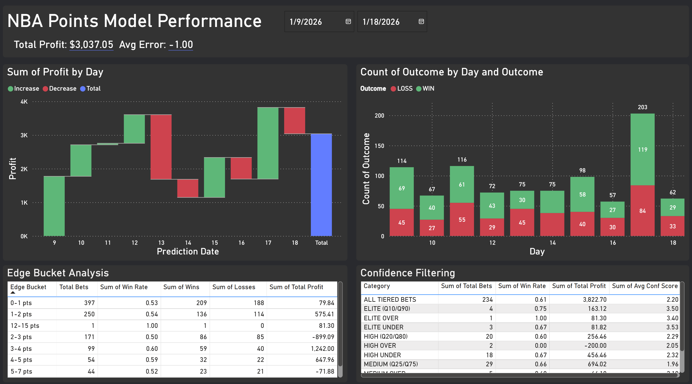
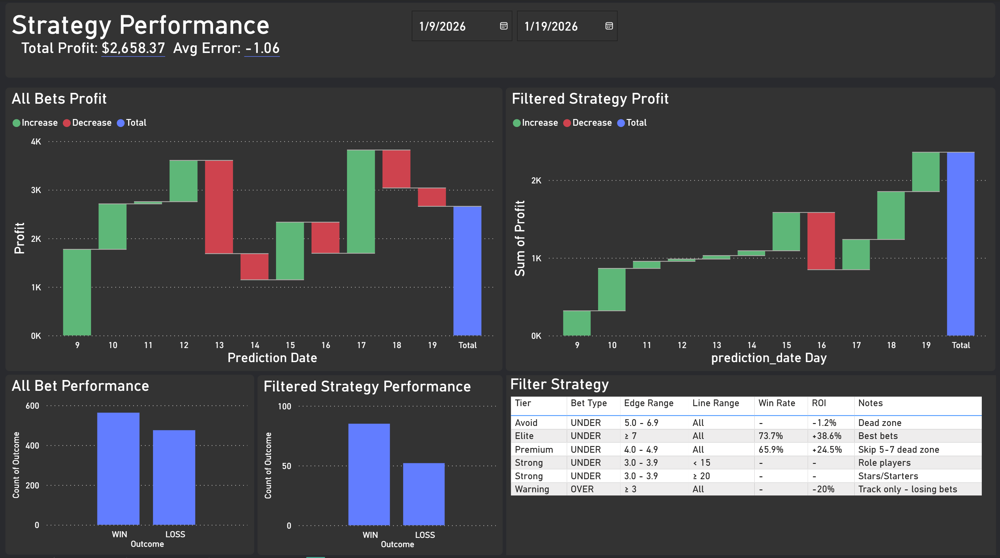

# NBA Player Points Prediction System


A production data pipeline and machine learning system that predicts NBA player point totals using **XGBoost quantile regression**. The system integrates multiple APIs, performs automated ETL processing, and generates actionable predictions with quantified uncertainty.

## What This Project Demonstrates

This project is an **end-to-end data engineering and analytics pipeline** that showcases skills directly applicable to fintech data infrastructure:

| Skill Area | Implementation |
|------------|----------------|
| **Data Pipelines** | Automated ETL from NBA API with incremental updates, caching, and data validation |
| **API Integration** | Multi-source integration (NBA Stats API, The Odds API) with rate limiting and error handling |
| **Data Quality** | Temporal data leakage prevention, validation checks, automated data freshness monitoring |
| **Python Engineering** | Modular architecture, configuration management, logging, reproducible workflows |
| **Machine Learning** | Quantile regression for uncertainty quantification, time-series cross-validation |
| **Production Systems** | Automated daily predictions, performance tracking, cumulative results monitoring |

---

## Live Performance Results (January 2026)

These are **real trading results**, not backtests:



### Key Metrics (Jan 9-19, 2026)

| Metric | Value |
|--------|-------|
| **Total Profit** | $3,037.05 |
| **Win Rate (Tiered Bets)** | 61% |
| **Average Prediction Error** | -1.00 points |
| **Sample Size** | 1,000+ bets |

### Strategy-Filtered Performance



| Strategy Tier | Win Rate | ROI | Description |
|---------------|----------|-----|-------------|
| **Elite (UNDER)** | 73.7% | +38.6% | High-confidence under bets with edge >= 7 |
| **Premium** | 65.9% | +24.5% | Under bets with 4-5 point edge, skip 5-7 dead zone |
| **All Tiered** | 61% | +16.3% | Combined filtered strategy |

### Edge Bucket Analysis

The model's profitability correlates with predicted edge:

| Edge Bucket | Total Bets | Win Rate | Profit |
|-------------|------------|----------|--------|
| 3-4 pts | 99 | 60% | $1,242.00 |
| 4-5 pts | 54 | 59% | $647.96 |
| 1-2 pts | 250 | 54% | $575.41 |

---

## Technical Architecture

### Data Pipeline Flow

```
NBA Stats API                    The Odds API
     |                                |
     v                                v
[1_data_loading_FIXED.py]    [3_calculate_predictions.py]
     |                                |
     v                                v
 Raw Box Scores              Live Betting Lines
     |                                |
     +----------------+---------------+
                      |
                      v
           Feature Engineering
           (40+ temporal features)
                      |
                      v
           [2_model_training.py]
                      |
                      v
           XGBoost Quantile Models
           (19 models: Q5 to Q95)
                      |
                      v
           Probability Estimation
                      |
                      v
           Expected Value Calculation
                      |
                      v
           [4_calculate_results.py]
                      |
                      v
           Performance Dashboard
```

### Key Technical Decisions

**1. Quantile Regression over Normal Distribution**
- Player scoring is right-skewed (bounded at 0, unbounded upside)
- 19 separate models capture the true empirical distribution
- Enables accurate probability estimation without Gaussian assumptions

**2. Strict Temporal Data Handling**
- All features use `.shift(1)` before rolling calculations to prevent leakage
- Time-series cross-validation with expanding window
- Train/test split by season (not random) to simulate real deployment

**3. Incremental Data Pipeline**
- Full reload: ~5-10 minutes (initial setup)
- Incremental update: ~10-30 seconds (daily operations)
- Smart caching for expensive API calls (tracking data, hustle stats)

---

## Code Samples

### 1. Data Pipeline with Leakage Prevention

```python
class NBADataLoader:
    """Load and engineer NBA features WITHOUT target leakage"""

    def engineer_rolling_features(self, df):
        """
        Calculate rolling averages with proper temporal ordering.

        CRITICAL: .shift(1) ensures we only use data available
        BEFORE the game we're predicting.
        """
        for window in [3, 5, 10]:
            for stat in ['PTS', 'MIN', 'FGA', 'FG3A', 'FTA', 'REB', 'AST']:
                col_name = f'{stat}_rolling_{window}'

                # CORRECT: shift THEN rolling - excludes current game
                df[col_name] = (
                    df.groupby('player_id')[stat]
                    .shift(1)  # <- Critical: look back from previous game
                    .rolling(window, min_periods=1)
                    .mean()
                )

        return df
```

### 2. API Integration with Rate Limiting

```python
def fetch_odds_from_api(self):
    """
    Fetch live betting lines from The Odds API.
    Implements caching and rate limit handling.
    """
    url = f"{ODDS_API_CONFIG['base_url']}/sports/{ODDS_API_CONFIG['sport']}/events"

    params = {
        'apiKey': ODDS_API_KEY,
        'regions': ODDS_API_CONFIG['regions'],
        'markets': ODDS_API_CONFIG['markets'],
        'oddsFormat': ODDS_API_CONFIG['odds_format'],
        'bookmakers': ODDS_API_CONFIG['bookmakers']
    }

    try:
        response = requests.get(url, params=params, timeout=30)
        response.raise_for_status()

        # Track API quota usage from headers
        remaining = response.headers.get('x-requests-remaining', 'N/A')
        logger.info(f"Odds API requests remaining: {remaining}")

        return response.json()

    except requests.exceptions.RequestException as e:
        logger.error(f"API request failed: {e}")
        return self._load_cached_odds()  # Graceful fallback
```

### 3. XGBoost Quantile Model Training

```python
def train_quantile_models(self, X_train, y_train):
    """
    Train separate XGBoost models for each quantile.
    Enables full distribution estimation without parametric assumptions.
    """
    quantile_models = {}

    # Dynamic GPU detection
    gpu_available = check_gpu_available()
    params = XGBOOST_PARAMS.copy()
    params['tree_method'] = 'gpu_hist' if gpu_available else 'hist'
    params['device'] = 'cuda' if gpu_available else 'cpu'

    for q in QUANTILES:  # [0.05, 0.10, ..., 0.95]
        logger.info(f"Training quantile {q} model...")

        # Quantile-specific loss function
        params['objective'] = 'reg:quantileerror'
        params['quantile_alpha'] = q

        dtrain = xgb.DMatrix(X_train, label=y_train)
        model = xgb.train(params, dtrain, num_boost_round=1000)

        quantile_models[q] = model
        model.save_model(f'models/quantile_{q}_model.json')

    return quantile_models
```

### 4. Expected Value Calculation

```python
def calculate_expected_value(self, line, odds, quantile_predictions):
    """
    Calculate EV by interpolating quantile predictions to estimate P(over).

    Args:
        line: Betting line (e.g., 24.5 points)
        odds: American odds (e.g., -110)
        quantile_predictions: Dict of {quantile: predicted_value}

    Returns:
        EV for over bet, EV for under bet
    """
    # Build empirical CDF from quantile predictions
    quantiles = sorted(quantile_predictions.keys())
    values = [quantile_predictions[q] for q in quantiles]

    # Interpolate to find P(X > line)
    prob_under = np.interp(line, values, quantiles)
    prob_over = 1 - prob_under

    # Convert American odds to decimal
    if odds > 0:
        decimal_odds = 1 + (odds / 100)
    else:
        decimal_odds = 1 + (100 / abs(odds))

    # EV = P(win) * profit - P(lose) * stake
    profit_if_win = decimal_odds - 1
    ev_over = (prob_over * profit_if_win) - (prob_under * 1)
    ev_under = (prob_under * profit_if_win) - (prob_over * 1)

    return ev_over, ev_under
```

---

## Feature Engineering (40+ Features)

| Category | Features | Purpose |
|----------|----------|---------|
| **Rolling Stats** | PTS, MIN, FGA, FG3A, FTA (3/5/10 game windows) | Recent performance trends |
| **Volatility** | Rolling std of PTS, FG% consistency | Player reliability |
| **Usage** | FGA rate, FTA rate, possession share | Role in offense |
| **Context** | Home/away, days rest, back-to-back | Situational factors |
| **Opponent** | Defensive rating, pace allowed | Matchup difficulty |
| **Efficiency** | TS%, expected points, hot/cold flags | Shooting quality |

---

## Technologies Used

- **Languages**: Python 3.9+
- **ML Framework**: XGBoost (GPU-accelerated)
- **Data Processing**: Pandas, NumPy
- **APIs**: NBA Stats API (nba_api), The Odds API
- **Visualization**: Matplotlib, Seaborn
- **Version Control**: Git
- **Output Formats**: Excel, HTML dashboards

---

## Project Structure

```
NBA_points/
├── scripts/
│   ├── 1_data_loading_FIXED.py      # ETL pipeline
│   ├── 1b_data_update_incremental.py # Daily incremental updates
│   ├── 2_model_training_FIXED.py    # Model training
│   ├── 3_calculate_predictions_CLEAN.py  # Daily predictions
│   └── 4_calculate_results_cumulative.py # Performance tracking
├── config/
│   ├── config.py                    # Central configuration
│   ├── data/                        # Training data
│   ├── models/                      # Trained XGBoost models
│   └── outputs/
│       └── predictions/             # Daily prediction files
└── CLAUDE.md                        # Technical documentation
```

---

## Daily Workflow

```bash
# 1. Update data (incremental - 30 seconds)
python scripts/1b_data_update_incremental.py

# 2. Generate predictions (1-2 minutes)
python scripts/3_calculate_predictions_CLEAN.py

# 3. Review predictions in Excel/HTML output

# 4. After games complete - track results
python scripts/4_calculate_results_cumulative.py
```

---

## Contact

**Alex Vineyard**
alex9vine@gmail.com
[GitHub: alexvineyard9](https://github.com/alexvineyard9)

---

*This project demonstrates end-to-end data pipeline development, API integration, machine learning model deployment, and production system monitoring - skills directly applicable to data engineering and analytics roles in fintech.*
